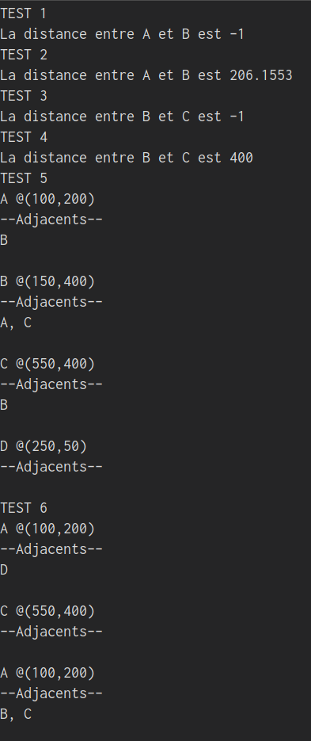
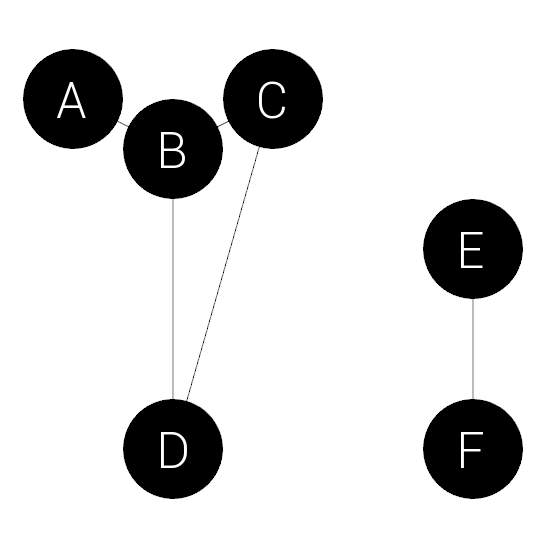
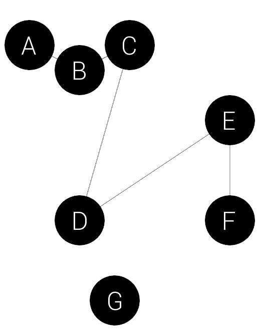
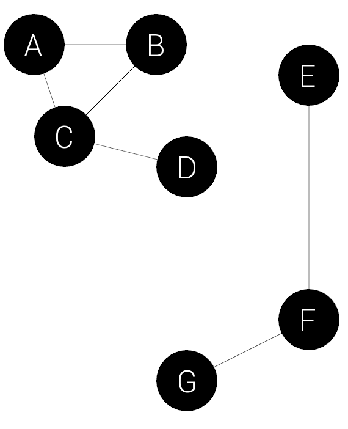

## Consignes

* [Téléchargez le projet de départ](pfi2019_depart.zip)
* Ce travail doit être fait individuellement;
* Plagiat → couler le cours;
* Aucune validation de données est demandée, pour alléger le travail;

## Mise en contexte
Vous devez créer un programme qui affiche un graphe composé de noeuds et de chemins entre des noeuds.
La bibliothèque SFML.NET est utilisée afin de gérer le graphisme.


## Phase 1 : `IClonable<T>`
Écrivez l'interface `IClonable<T>`. Cette interface contient qu'une seule méthode : `Clone()` qui retoune un `T`.

## Phase 2 : la classe `Noeud`
Un noeud est un objet qui peut être cloné (`IClonable<T>`) pour retourner un nouveau noeud. Un noeud peut aussi être affiché dans une fenêtre SFML (`Drawable`).

### Attributs/Propriétés

* `string étiquette` : un étiquette pour identifier le noeud. Par exemple, le noeud $A$;
* `Vector2<float> position` : la position dans l'espace 2D du noeud;
* `Noeud[] adjacents` : les noeuds qui sont _adjacents_ au noeud;
* `int capacité` : le nombre de maximum d'adjacents que le noeud peut supporter;
* `int nbAdjacents` : le nombre actuel de noeuds adjacent au noeud;

Aucune propriété doit être modifiable par un client. Il ne doit pas être possible de retourner, à un client, un type référence à un objet non-immuable via les propriétés.

### Les adjacents
Chaque noeud a un tableau de noeuds contenant ses noeuds adjacents. Si un noeud $B$ est adjacent à un noeud $A$, il y a un chemin **direct** entre ces deux noeuds. Conséquemment, $A$ est également adjacent à $B$.

Il est possible de savoir s'il existe un chemin entre deux noeuds en utilisant le tableau d'adjacents. Par exemple, si $A$ est adjacent à $B$ et que $C$ est aussi adjacent à $B$, il existe un chemin entre $A$ et $C$, même si $A$ et $C$ ne sont pas adjacent.

### Constructeurs
Cette classe doit avoir un constructeur paramétrique qui prend en paramètre l'étiquette, la position et la capacité du nouveau noeud à construire.

La classe doit aussi avoir un constructeur de copie **qui ne copie pas les adjacents**, afin d'éviter une boucle infinie. Utilisez le premier constructeur pour implémenter le constructeur de copie.

### Méthodes
1. `public void AjouterNoeudAdjacent(Noeud adjacent)` : cette méthode doit ajouter un noeud adjacent au noeud appelant cette méthode. Bien entendu, le noeud appelant cette méthode (`this`) devient aussi un adjacent du noeud prit en paramètre. Cette tâche ne peut pas être complétée, par contre, si les noeuds ont atteinte leurs capacités.

2. `bool EstSaturé()` : cette méthode utilitaire indique si le noeud à pleine capacité.

3. `public float CalculerDistance(Noeud autre)` : retourne la distance entre le noeud appelant cette méthode et un noeud prit en paramètre. La méthode doit retourner `-1` si le noeud prit en paramètre n'est pas un noeud adjacent (la distance peut juste être calculée entre noeuds adjacents).

4. Implémentez le _design pattern_ de clonage.

5. `public Noeud[] CopierAdjacents()` : afin d'avoir une façon de retourner tous les adjacents à un client sans avoir de bris d'encapsulation, cette méthode doit retourner une copie des adjacents (où les copies n'ont pas d'adjacents). 

6. Faites une surcharge de `ToString()` afin quelle affiche le format suivant :
```
_étiquette_ @_position_
--Adjacents--
_étiquetteAdjacent1_, _étiquetteAdjacent2_, etc.
```

Ex :
```
B @(150.400)
--Adjacents--
A, C
```

### Tests
Afin de tester votre classe, démarrez le programme après avoir enlevé le commentaire à la ligne 15 de `Program.cs`. Ceci va appeler une suite de tests que vous pouvez utiliser pour valider votre code.



## Phase 3 : La classe `Graphe`
```
using System;
using System.Collections.Generic;
using System.Linq;
using SFML.Graphics;
using SFML.System;

namespace pfi2019
{
    public class Graphe : //Complétez cette ligne
    {
    	//COMPLÉTEZ LA CLASSE
	
        public void Draw(RenderTarget target, RenderStates states)
        {
            DéssinerChemins(target, Noeuds);
            foreach (var n in noeuds)
                n.Draw(target, RenderStates.Default);
        }
        
        void DéssinerChemins(RenderTarget target, List<Noeud> noeuds)
        {
            foreach (Noeud n in noeuds)
            {
                foreach (Noeud a in n.CopierAdjacents())
                {
                    if (Noeuds.Contains(a))
                    {
                        Vertex[] chemin = new Vertex[2];
                        chemin[0] = new Vertex(new Vector2f(n.Position.X + 50, n.Position.Y + 50), Color.Black);
                        chemin[1] = new Vertex(new Vector2f(a.Position.X + 50, a.Position.Y + 50), Color.Black);

                        target.Draw(chemin, 0, 2, PrimitiveType.Lines);
                    }
                }
            }
        }
    }
}
```

Créez une classe `Graphe` avec le code ci-haut. Vous devez compléter cette classe. 
Un graphe est clonable et peut être affiché dans une fenêtre SFML.
Un graphe est essentiellement une liste de noeuds qui peut faire des traitements basés sur cette données.

### Attributs/Propriétés

* `List<Noeud> noeuds` : une liste de tous les noeuds dans le graphe;
* `int NbChemins` : une propriété calculée qui retourne le nombre de chemins **uniques** dans le graphe. **Toute la logique doit être faite en une ligne et avec une _lambda_ en utilisant LINQ**.

Aucune propriété doit être modifiable par un client. Il ne doit pas être possible de retourner, à un client, un type référence à un objet non-immuable via les propriétés.

### Constructeurs
* Un constructeur par défaut;
* Un constructeur de copie qui fait une copie **en profondeur** d'un graphe. Le nouveau graphe doit avoir exactement le même état que l'original.

### Méthodes

* `public void AjouterNoeud(Noeud noeudÀAjouter)` : cette méthode doit ajouter un noeud au graphe, si le noeud n'est pas déjà contenu dans le graphe;
* Implémentez le _design pattern_ de clonage;

**BONUS**

* `public bool ACheminEntre(Noeud a, Noeud b)` : le but de cette méthode est de retourner s'il existe un **chemin** entre les deux noeuds donnés en paramètre. Cette méthode sert principalement à appeler la méthode suivante :
* `bool ACheminEntre(Noeud a, Noeud b, List<Noeud> visités)` : Cette méthode privée fait presque tout le travail pour `ACheminEntre(Noeud a, Noeud b)` en utilisant une liste de noeud qui commence vide. Cette liste est pour garder en mémoire tous les noeuds visités dans l'optique de trouver s'il existe un chemin entre deux noeuds. Pour vous aider, rendez la propriété pour le tableau d'adjacents d'un noeud `public`. Pour réaliser ce problème, vous pouvez utiliser un algorithme _récursif_, ce qui implique que cette méthode appel _elle-même_ pour résoudre le problème. Un cas : pour **trouver s'il y a un chemin** entre $A$ et $F$ (où ces deux noeuds ne sont pas adjacentes), il faut **trouver s'il y a un chemin** entre $B$ et $F$, alors il faut **trouver s'il y a un chemin** entre $C$ et $F$, ... 

### Tests
Décommentez tous le code dans `Program.cs`, mais commentez la ligne `CréerScène(TestsGraphe.Test4())`. Commentez aussi la ligne `CréerScène(TestsGraphe.Test5())` si vous n'avez pas fait le bonus.

#### Test1 et Test2



#### Test3

Console :
`Nombre de chemin unique : 5`

#### Test5



Console :
```
True
False
```


## Phase 4 : Créer des noeuds à partir d'un fichier
Dans la classe `Program.cs`, écrivez la fonction `public static List<Noeud> CréerNoeudsDeFichier(string cheminDuFichier)`.

Cette fonction doit lire un fichier texte où chaque ligne représente un noeud. Les lignes sont formatées de la façon suivante : `étiquette;posX:posY;capacité;adjacent1,adjacent2,adjactent3...`

Notez qu'il est aussi possible qu'un noeud n'aille pas d'adjacents : `étiquette;posX:posY;capacité`.

Vous devez retourner une liste de noeud, où chaque noeud est créé à partir d'une ligne du fichier. Le `Test4` de `TestsGraphe` utilise cette fonction avec le fichier `noeuds` (dont vous avez déjà).


### Tests
Décommentez la ligne `CréerScène(TestsGraphe.Test4())` dans `Program.cs`.


