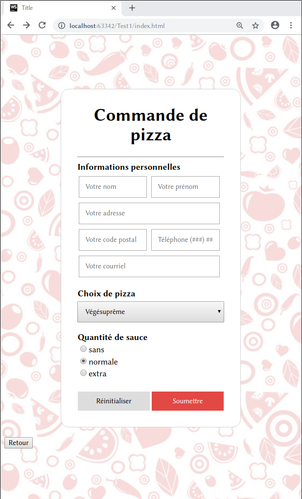
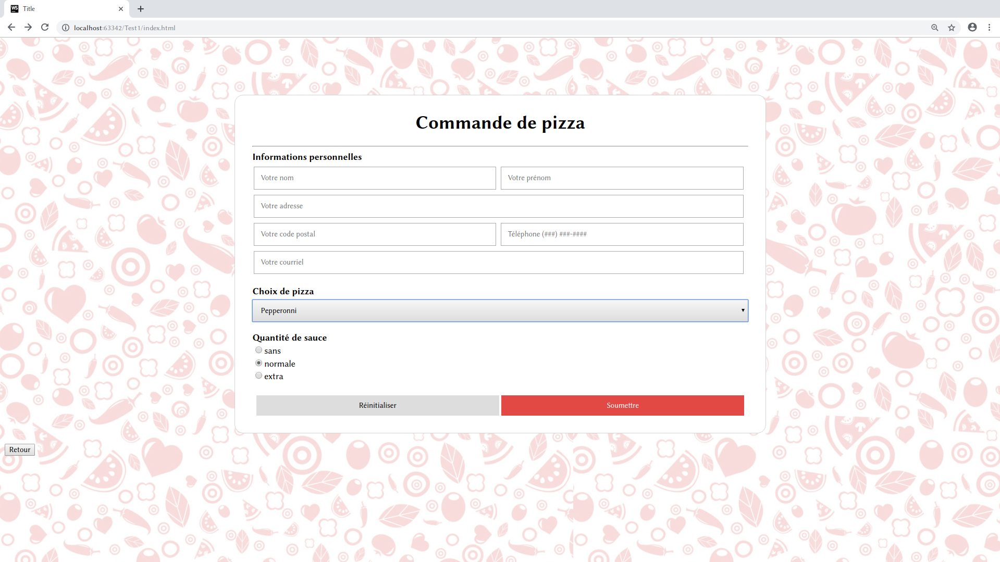

[**SOLUTION**](Labo2.zip)

Ce laboratoire porte sur la création d'un formulaire à l'aide du HTML et un CSS. Ce travail se concentre sur l'intégration des nouvelles balises vu en classe (`form`, `input`, `button`, ...), ainsi que sur la révision de CSS.

Votre travail servira comme base pour la partie B, qui ajoutera plus de fonctionnalités à votre formulaire grâce à JS.

## Consignes générales
* Le CSS **doit** être un fichier externe de la page HTML.
* Le formulaire **doit** contenir tous les mêmes éléments que ceux présentés dans les images ci-dessous.
* La disposition des éléments **doit** être comme dans les images.
* Copier le style des éléments présentés le plus possible, par contre vous pouvez choisir votre propre _background_ et vos propres couleurs et polices.

Ouvrez les images dans un nouvel onglet pour un aperçu plus grand.

## Informations personnelles
Le client du formulaire **doit** entrer son nom, prénom, adresse, code postal et téléphone. Le client **peut** entrer son courriel, mais ceci n'est pas nécessaire pour la soumission du formulaire.

* Utilisez les `input` de type `text`, `tel` et `email`. Mettez des `placeholder`.
* Utilisez un `table` pour disposer les `input` de façon appropriés. L'attribut `colspan` pourrait vous servir.

## Choix de pizza
Cette section contient une liste déroulante avec deux groupes d'options : carnivore et végétarien.

Les options carnivores sont «pepperonni» et «bacon». Les options végétarien sont «végésuprême» et «asiatique».

Faites des recherches sur l'utilisation de la balise `<optgroup>`, pour vous aider à créer la liste.

## Quantité de sauce
Ici, ajoutez trois pastilles pour permettre aux clients de personnaliser leurs pizzas. La quantité «normale» doit être cochée par défaut. Aussi, assurez-vous qu'une seule pastille peut être cochée à la fois.

## Boutons
Ajoutez un bouton pour réinitialiser (_reset_) le formulaire. Ajoutez un bouton pour soumettre (_submit_) les données du formulaire à un serveur.
Ajoutez un dernier bouton **à l'extérieur* du formulaire qui est étiquetté «Retour». Ce bouton n'aura pas d'action, pour le moment.

## Soumission vers un serveur
Soumettez le formulaire à un serveur externe. Déclarez votre balise `form` comme suit :
`<form action="http://profd.info/testsoumettre.php" method="post">`.
