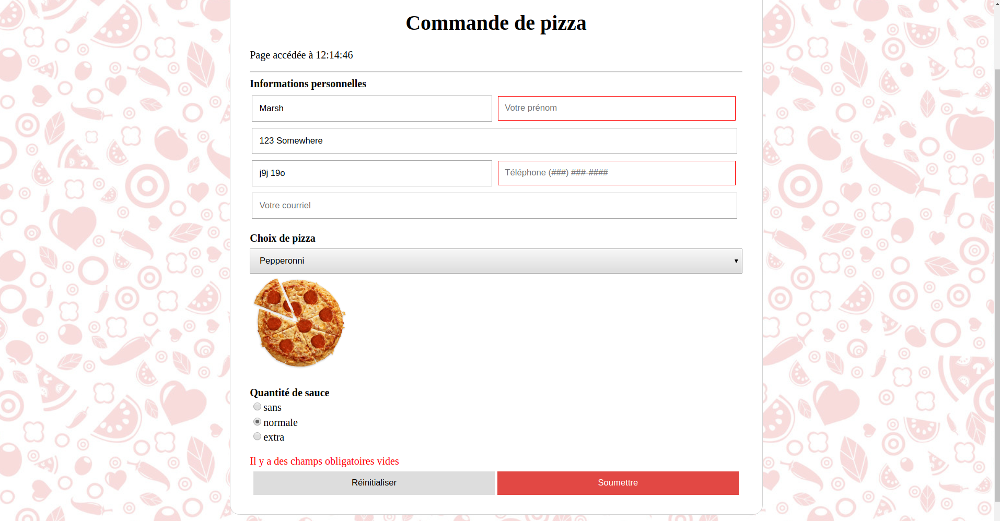

## Boite à outils

**Chercher un ou plusieurs éléments du DOM**

* document.getElementByID
* document.getElement**s**ByTagName
* document.getElement**s**ByName
* document.getElement**s**ClassName
* document.querySelector
* document.querySelectorAll
* document.forms[...].elements[...]
 
**Propriétés d'événements**

* onclick
* onchanged

**Autres propriétés**

* value
* src
* style.border
* innerHTML

**Temps**

* `new Date().toLocaleTimeString()`

**Revenir dans l'historique**

* `history.back()`

## Consignes
Ajoutez les fonctionnalités suivantes dans votre page web :

1. Dans le haut du formulaire, affichez l'heure quand la page a été accédée.
2. Lorsque le bouton pour soumettre est cliqué, mettez en évidence tous les champs obligatoires qui sont vides. Pour mettre en évidence, les bordures des champs devront devenir rouge. Les bordures devront revenir à leur état initials, lorsque les champs sont corrigés.
3. Lorsque qu'il manque un ou plusieurs champs obligatoires et une tentative de soumission est faite, affichez le message «Il y a des champs obligatoires vides» dans la page.
4. Affichez une image de pizza selon le choix de pizza. Par exemple, une pizza au pepperonni doit être affichée si le client sélectionne «Pepperonni» comme choix.
5. Le bouton «retour» doit faire naviguer le client à sa dernière page rendue.
6. Si le client clique sur le bouton pour réinitialiser le formulaire, une alerte indiquant que les champs seront réinitialisés doit apparaître.

## Remise
Le laboratoire 2 complet sera évalué en classe le 27 février. 
