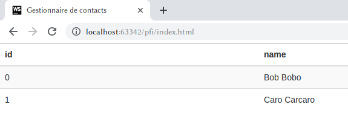
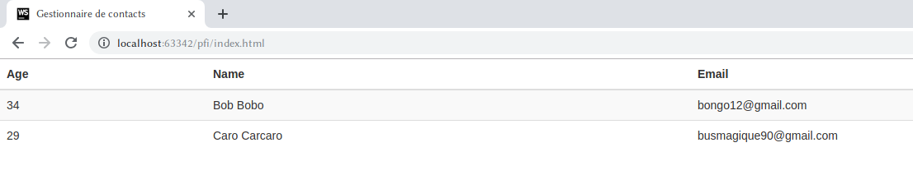
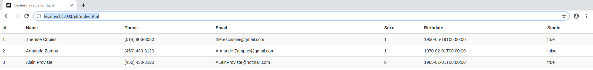

## Consignes

* Ce travail est à faire **individuellement**;
* Ce travail est composé de 3 phases. Chaque phase sera publiée sur cette page;
* Soyez consistant dans la langue (anglais ou français);
* Découpez votre code en fonctions (une tâche → une fonction);
* Nommez vos données et fonctions avec des noms significatifs;
* L'enseignant peut moins vous guider pour ce travail, comparé aux laboratoires.


## Préparation du projet
Suivez les étapes suivantes, afin de préparer les ressources pour le projet :

1. Créez un fichier `index.html`;
2. Créez un fichier `main.js`;
3. Créez un fichier `styles.js`;
4. Dans `index.html`, ajoutez une référence vers une version minimisée de jQuery hébergée sur un CDN;
5. Dans `index.html`, ajoutez une référence vers `main.js`;
6. Dans `index.html`, ajoutez la balise suivante :  
`<link rel="stylesheet" href="https://maxcdn.bootstrapcdn.com/bootstrap/3.4.0/css/bootstrap.min.css">`. Ceci est un fichier CSS situé sur un CDN;
7. Dans `index.html`, ajoutez une référence vers `styles.css`.
8. Dans le `body` d'`index.html`, ajoutez un `div` avec le id _contenu_ ou _content (choisissez entre français et anglais).

## Phase 1 : Chercher des données d'un service web et génération d'éléments du DOM
Tous le travail pour cette phase se produit dans `main.js`. Le but est de chercher des informations de contact d'un service web avec une requête HTTP.

### La fonction `creerTableContacts`/`createContactTable`
Créez une fonction `creerTableContacts`/`createContactTable` qui prend deux paramètres.
Le premier paramètre est un objet de sélection jQuery. Le deuxième paramètre est un tableau.

**N.B. : ** Il n'est pas nécessaire de valider les paramètres.

Le tableau contiendra des objets qui représentent chacun un contact. Chaque contact a plusieurs propriétés, soit son _id_, son _nom_, son _email_, etc. Tenez pour acquis que chaque contact a *les mêmes propriétés dans le même ordre*.

Le but de cette fonction est de générer une `table` HTML en utilisant les contacts comme contexte de données.

La syntaxe pour une `table` HTML est :
```
<table>
  <thead>
    <tr>
      <th>...</th>
      <th>...</th>
      ...
    </tr>
  </thead>
  <tbody>
    <tr>
      <td>...</td>
      <td>...</td>
      ...
    </tr>
    <tr>
      <td>...</td>
      <td>...</td>
      ...
    </tr>
    ...
  </tbody>
</table>
```

En utilisant `document.createElement(...)`, `.appendChild(...)` et des boucles, vous pouvez créer une `table` de façon dynamique.

**N.B. : ** N'oubliez pas la différence entre un `for of` et un `for in` ! Un `for of` est pratique pour itérer entre chaque élément d'un tableau. Un `for in` est pratique pour itérer entre chaque propriété d'un objet (chaque clé d'un tableau associatif).

Ajoutez les classes CSS _table_ et _table-striped_ à la `table`. Ces classes viennent du fichier _bootstrap.min.css_ référé.

Votre fonction doit, finalement, insérer la `table` créée dans la balise sélectionnée de l'objet jQuery (le premier paramètre).

#### Tester la fonction
```{js}
window.onload = function() {
  let contactData = [{"Id" : 0, "Name" : "Bob Bobo"},{"Id" : 1, "Name" : "Caro Carcaro"}];
  createContactTable($("#content"), contactData);
}
```



```{js}
window.onload = function() {
  let contactData = [{"Age" : 34, "Name" : "Bob Bobo", "Email" : "bongo12@gmail.com"},{"Age" : 29, "Name" : "Caro Carcaro", "Email" : "busmagique90@gmail.com"}];
  createContactTable($("#content"), contactData);
}
```



### La requête HTTP
En utilisant `$.get(...)` avec l'URL http://www.informatique.clg.qc.ca/KB5_Contacts/api/Contacts (aucun paramètre dans l'URL), cherchez de l'information de contacts. L'URL pointe vers un service web qui retourne la réponse JSON suivante :
```
[
  {
    "Id":1,
    "Name":"Thérèse Cripies",
    "Phone":"(514) 806-8030",
    "Email":"therescrispie@gmail.com",
    "Sexe":1,
    "Birthdate":"1950-05-19T00:00:00",
    "Single":true
  },
  {
    "Id":2,
    "Name":"Armande Zampu",
    "Phone":"(450) 430-3120",
    "Email":"Armande.Zampue@gmail.com",
    "Sexe":1,
    "Birthdate":"1970-02-01T00:00:00",
    "Single":false},
  {
    "Id":3,
    "Name":"Alain Proviste",
    "Phone":"(450) 430-3120",
    "Email":"ALainProviste@hotmail.com",
    "Sexe":0,
    "Birthdate":"1965-01-01T00:00:00",
    "Single":true
  }
]
```

Votre page doit, dans un premier temps, faire la requête. En deuxième lieu, elle doit créer une `table` dans le `div` _content_ avec `createContactTable` où les contacts sont ceux retournés par la requête.


