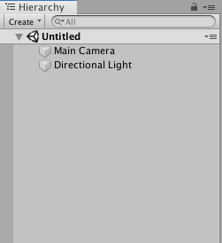
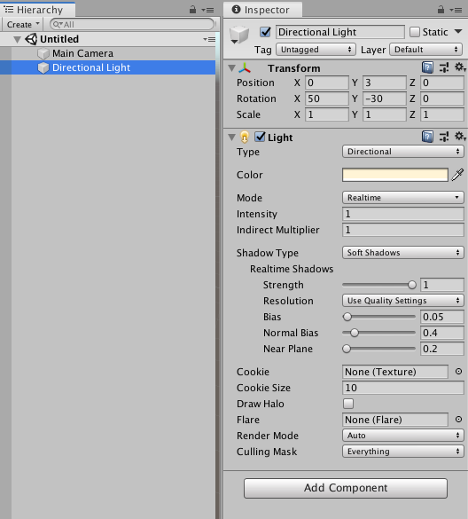

La disposition de fenêtres par défaut dans l'éditeur affiche quatre sections :

* Hiérarchie;
* Inspecteur;
* Scène;
* Projet.

## Visualiser et modifier les `GameObject` et leurs `Component`
Parmi les quatre sections par défaut, il y en a une pour les `GameObject` et une autre pour les `Component` d'un `GameObject` choisi. Celles-ci sont la _hiérarchie_ et l'_inspecteur_, respectivement.

#### La hiéarchie
La colonne de gauche est une hiérarchie des `GameObject` instanciés dans la scène.

_Untitled_ est le nom de la scène acutellement ouverte dans l'éditeur. Dans cette scène, il y a deux objets. Dans une nouvelle scène, l'éditeur place deux objets par défaut. Ceux-ci sont _Main Camera_ et _Directional Light_. Les deux sont des `GameObject`, **car tout ce qui existe dans une scène est un `GameObject`**. _Main Camera_ et _Directional Light_ ne sont pas des noms de classes, mais des valeurs pour l'attribut `name` de chaque `GameObject`. Ces deux objets ont des fonctionnalités très distinctes, malgré que les deux soient de la même `class`, à cause de leur ensemble de `Component`.

#### L'inspecteur
La fenêtre à gauche est l'_inspecteur_. Celle-ci sert à visualiser et modifier les `Component` d'un `GameObject`. En sélectionnant un objet dans la hiérarchie (ou en cliquant dessus dans la visualisation de la scène), l'inspecteur liste toutes les composantes de l'objet.

Le `GameObject` _Directional Light_ contient un `Transform` et un `Light`. En plus d'énumérer les `Component`, l'inspecteur permet de voir et manipuler les valeurs de plusieurs attributs des composantes.

## La scène
La section au centre de l'éditeur contient trois onglets :

* Scene;
* Game;
* Asset Store.

Pour l'instant, ignorons l`_Asset Store_.

#### Scene
L'onglet _Scene_ montre la scène et les entités qui y habitent. Il est possible de faire des transformations sur la position, la rotation et l'échelle d'un objet directement dans la scène actuelle. Ceci est pratique pour placer des objets et construire un environnement, comme dans un logiciel de modelage 3D.

Dans l'éditeur, l'utilisateur est l'observateur de la scène qu'il construit. Dans le jeu, une ou plusieurs _caméra_ sont les observateurs. Donc, pour observer la scène dans l'éditeur, il ne faut pas transformer une caméra (comme `Main Camera`), mais plutôt l'« utilisateur ».

Utiliser la souris est la façon simple : 

* clic centre + bouger la souris → translation gauche, droite, haut, bas;
* roulette → translation par en avant, par en arrière;
* clic gauche + bouger la souris → rotation.

#### Game
L'onglet _Game_ permet de tester et déboguer la scène actuelle. L'état de l'exécution de la simulation est contrôlé avec ces boutons en haut de l'éditeur :

Lorsque le bouton _Play_ est cliqué, l'éditeur entre en _Play Mode_. Dans ce mode, il est toujours possible de modifier la scène, permettant d'ajouter des objets de jeu ou même de manipuler des composantes d'objets. Au lieu d'arrêter le test, de changer la scène et de retester, des modifications peuvent être faites pendant l'exécution du jeu — très pratique pour déboguer. Les modifications peuvent être faites sans crainte, car elles ne persistent pas après la fin des tests. C.-à-d. que toutes manipulations de scènes faites dans l'éditeur en _Play Mode_ ne sont pas sauvegardées.

**Kyle, met donc une capsule icitte**

## Le projet
En bas de l'éditeur se trouve une section avec deux onglets. Le premier étant _Project_ et le deuxième _Console_.

Pour les habitués d'IDE comme Visual Studio et Rider, _Project_ est une zone pour naviguer et sélectionner des ressources liées au projet. Ces ressources sont appelées des _Assets_, dans le champ lexical d'Unity.

Les catégories d'asset populaires sont :

* Texture;
* Modèle 3D;
* Matériau;
* Audio;
* Prefab;
* Script;
* Bibliothèque (dll).

L'onglet pour la console est utilisé pour le débogage, notamment, en affichant des messages à l'intérieur. Cette console n'est pas utilisée pour des intrants utilisateurs.

