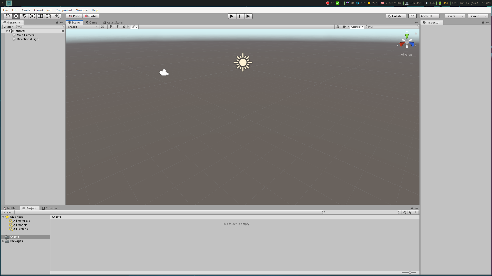
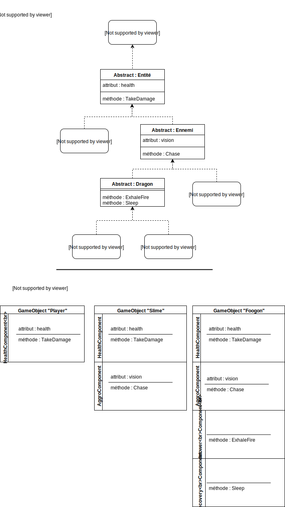

Il y a des ingrédients de bases à apprivoiser dans l'écosystème de Unity, avant de pouvoir commencer à développer un premier projet.

Travailler avec un moteur de jeu tel qu'Unity est différent d'écrire un nouveau programme ; le moteur est déjà un programme et le but est d'interagir avec. Par exemple, beaucoup de code sert à communiquer avec le moteur, afin de lui dire quelles opérations faire sur l'état du jeu.

De plus, la fondation du développement dans Unity repose sur un modèle de conception (_design pattern_) qui n'est typiquement pas enseigné dans les cours de P.O.O.. Ici, les concepts de _scènes_, _entité_ et _composantes_ sont explorés.

## L'écosystème d'Unity
"Unity" réfère, habituellement, à plusieurs composantes. Ensemble, ils font un environnement de développement. Pour simplifier, il y a deux éléments fondamentaux :

* L'éditeur;
* Le moteur;

### L'éditeur

L'éditeur permet de gérer les fichiers d'un projet Unity, ainsi qu'à modifier l'univers de jeu en communiquant avec le moteur, tester des simulations, surveillez les ressources du système, etc. C'est un outil complet et visuel pour développer.

### Le Moteur
Le moteur est un programme qui reçoit des données et les utilise pour exécuter le jeu. Tous les systèmes nécessaires pour les jeux modernes existent dans le moteur, donc il n'est qu'une question de les utiliser. Par exemple, un système d'effets de particules existe déjà dans le moteur.

Comme la majorité des moteurs de jeux, celui d'Unity est écrit en C++. Par contre, le langage utilisé pour communiquer avec le moteur est C#. Le moteur possède un API[^1] qui permet à Mono (une machine virtuelle pour C#) de communiquer avec. L'API rend accessibles des fonctions C# avec une bibliothèque (notamment UnityEngine) qui, une fois appelée par Mono, exécute une fonction C++ du moteur. 

**N.B.** Il est aussi possible d'utiliser la machine virtuelle LLVM en compilant le C# en C++ avec IL2CPP.

Dans ce contexte, le C# est nommé un langage de _scripting_. Ces langages servent principalement à manipuler des programmes **en exécution**, comme un moteur de jeu ou un navigateur web. Notamment, le langage JavaScript ­ un des langage de _scripting_ le plus populaire ­ est principalement utilsé pour communiquer avec un programme de navigateur web, comme _Chrome_. En fait, Javascript était le premier langage de scripting choisi pour Unity. Maintenant, Unity est optimisé pour C#.

## La scène
Dans l'éditeur, il est possible de visualiser et modifier une scène. Une scène est un espace 2D ou 3D qui représente l'univers du jeu à un moment donné. Un jeu contient, habituellement, plusieurs scènes. Il peut y avoir une scène pour le menu principal, une scène pour chaque niveau, une scène pour la personnalisation de personnages, etc.

Une scène est aussi un conteneur pour les instances qui représente des objets de jeux. Par exemple, une scène contient habituellement au moins une caméra et une lumière ambiante.

## Le modèle _Entity-Component_
La majorité des jeux Unity repose sur le concept de **`GameObject`**. Un `GameObject` est une entité qui existe dans l'univers du jeu. Les joueurs, les ennemis, les projectiles, etc. sont habituellement des `GameObject`, par exemple.

Par contre, un `GameObject` est une `class` qui n'est qu'essentiellement un conteneur de **`Component`**. Un `Component` possède un état et des comportements pour traiter ses données. Les `Components` sont des objets à la manière P.O.O, donc un `GameObject` contient des instances de classes de composantes.

Exemple : un `GameObject` a une composante `Transform` qui représente la position, la rotation et l'échelle du joueur. Le `Transform` a une méthode pour faire une translation, ce qui change sa donnée de position, modifiant conséquemment son état. La donnée de position de la composante est utilisée pour afficher l'entité dans l'espace. 

Exemple 2 : Un `GameObject` peut également posséder une instance de la composante `Health` qui s'occupe des tâches liées aux points de vies de l'entité. `Health` peut contenir une méthode `TakeDamage` qui affecte une donnée `HP` et colore le `GameObject` en rouge.

Dans les deux cas, les `Component` sont agnostiques de ce que le `GameObject` représente dans l'ensemble. Les `Components` peuvent — en général­ s'attacher à n'importe quelle entité, que ce soit un joueur, un ennemi, etc.

Cette façon de concevoir des objets de jeu s'appelle _Entity-Component_, car une entité est faite de composantes. Au lieu d'avoir une `class` _Joueur_, il y a un `GameObject` qui contient toutes les composantes qui sont nécessaires à concevoir une représentation du joueur. Le `GameObject` pour le joueur peut avoir les `Component` `Transform` et `Health`, de manière que chaque ennemi peut aussi avoir le même sous-ensemble de `Component`. Si un joueur ou un ennemi `TakeDamage`, il y a effectivement une perte de `HP` et l'entité devient rouge ; un `Component` bien implémenté est réutilisable !

_Entity-Component_ encourage les relations **a un** au lieu d'**est un**. Autrement dit, l'agrégation/composition est plus appropriée que l'héritage. 

Bref :

* Les entités sont des `GameObject`;
* Un `GameObject` est fait de `Component`;
* Pas de hierarchie d'héritage lourd;
* L'effort est sur le développement de `Component` modulaire.

[^1]: En résumé, une interface qui permet la communication entre deux logiciels.

