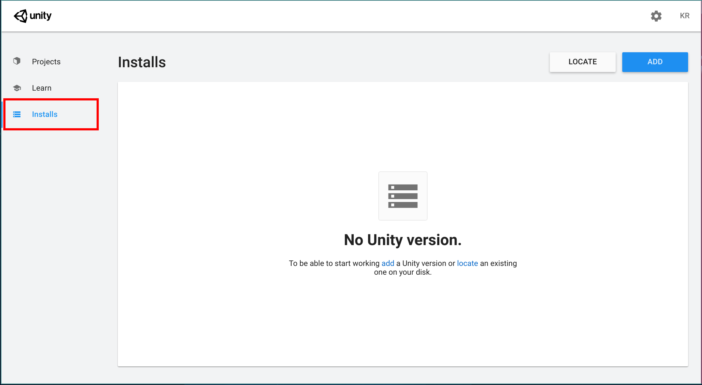
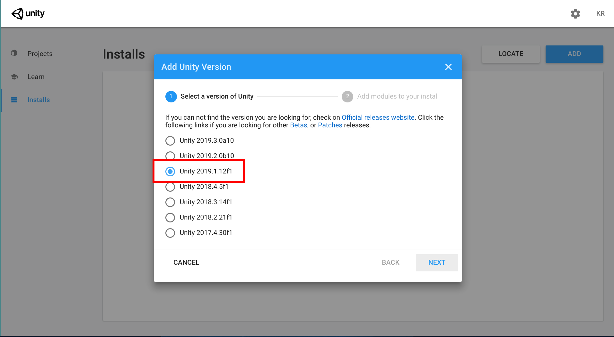
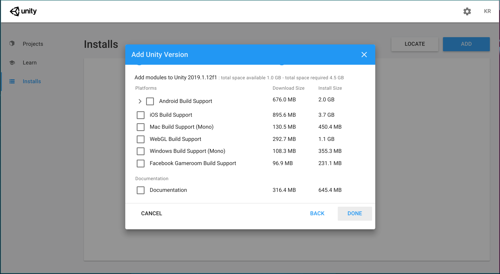
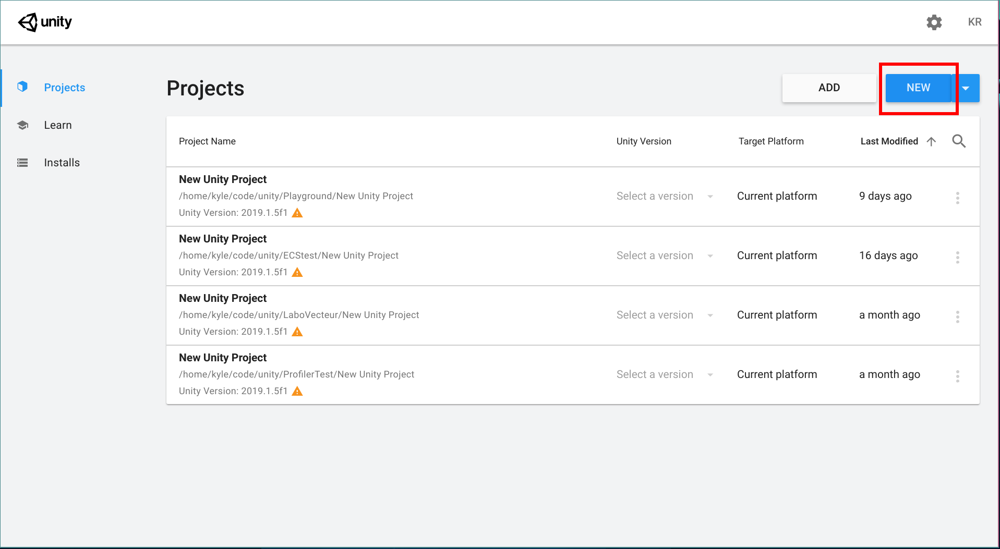
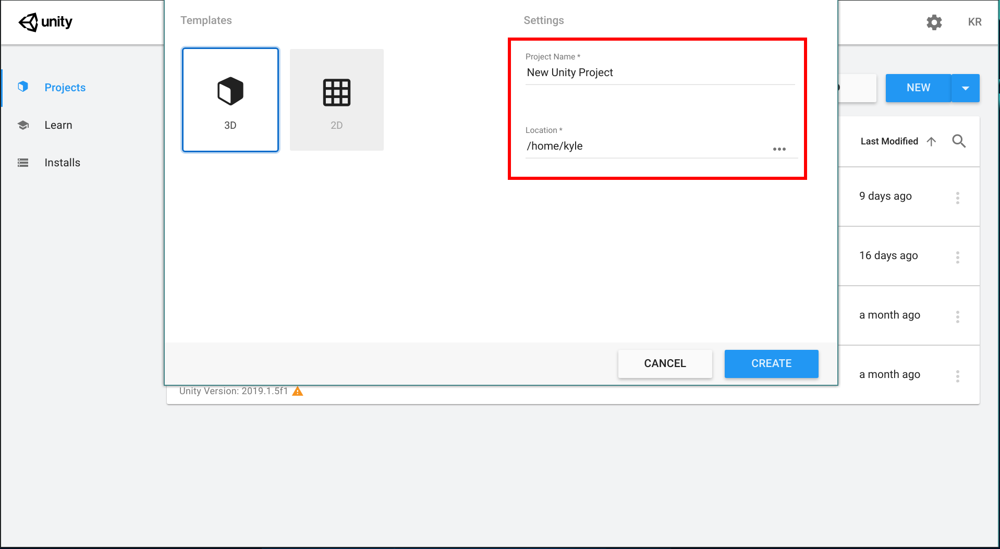
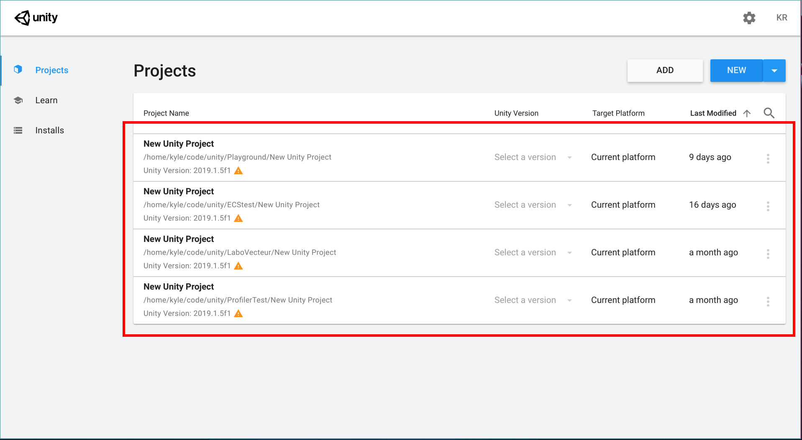

_Unity Hub_ est un logiciel pour gérer les projets Unity et les versions d'Unity installées sur la machine. Il est préférable d'utiliser ce logiciel pour créer et ouvrir des projets.

## Installer Unity Hub
https://store.unity.com/download?ref=personal 

## Installer une version d'Unity

### Aller dans la section _Installs_

### Sélectionner la version finale la plus récente

### Sélectionner les ajouts

 

## Créer un nouveau projet Unity

### Aller dans la section _Projects_

### Nommez le projet et choisir l'emplacement

  

## Ouvrir un projet Unity
### Aller dans projects et cliquer sur un projet

