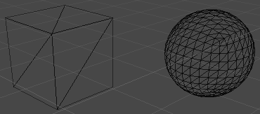
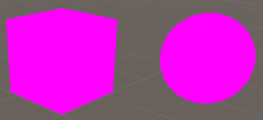
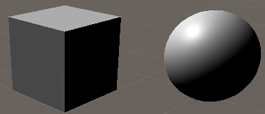

## Maillage
Un maillage est, essentiellement, un modèle 3D. En anglais, le mot pour maillage est _mesh_.

Bien qu'il soit possible de générer un maillage de façon procédurale, les maillages sont souvent importés dans un projet. Les extensions de fichiers populaires sont .obj, .3ds, .x, etc.

Un maillage est une structure de donnée contenant une liste de points, de triangles, d'UVs, etc. Bref, un maillage contient toutes les données brutes pour afficher une géométrie dans un espace 3D. Par contre, un maillage ne décrit pas seul comment le colorer et ne contient pas de textures.

## Matériau
Un matériau est une ressources qui est utilisé pour ombrager et texturer une maillage. Dans Unity, cette ressources prend la forme d'un fichier qui représente le choix d'un _shader_ et les valeurs pour les paramètres du _shader_. Des exemples de paramètres sont les textures à utiliser pour envelopper le maillage.

## _Shader_
La logique qui décrit comment ombrager une forme s'appel un _shader_. La majorité des _shaders_ tiennent compte des sources de lumières dans l'espace où se trouve la forme. Bien entendu, un écran affiche une image 2D, mais dessiner des ombres sur une image plate rend l'illusion de la profondeur.

_sans ombrages_

_avec ombrages_

Un shader peut être également conçu pour recréer des effets de vitres, d'eaux, de trips d'acide, etc. Pour des exemples interactifs avec code : [https://www.shadertoy.com](https://www.shadertoy.com/)

Voici quelque paramètres populaires d'un _shader_ moderne :

* _Albedo Map_  
Un _albedo map_ (aussi appelé _diffuse map_) est une image qui sert à texturer une surface. Cette image ne devrait pas contenir d'ombres et de reflets, car ceux-ci pourront être calculés et appliqués dynamiquement. Si les ombres et reflets sont directement « peinturés » sur une surface, ils ne seront pas appropriés si une lumière ambiante se déplace, par exemple.

* _Normal Map_  
Un _normal map_ (aussi appelé un _bump map_) est une image qui sert à générer l'illusion de relief sur une surface. Au lieu de déformer un maillage et de le complexifier, un _normal map_ dit au _shader_ comment colorer des ombres qui contribuent à l'illusion. Il est facile de reconnaître une image qui sert de _normal map_ par sa palette de couleur principalement mauve.

_Kyle, met une capsule ici qui montre comment un bon albedo et normal map réagit à la lumière_

Le shader par défaut dans Unity est _Standard_. Ce shader permet de faire des rendus photoréaliste selon les propriétés physiques du vrai monde de la lumière. En anglais, ce type de rendu s'appel _physics based rendering_ ou _PBR_. https://www.youtube.com/watch?v=_LaVvGlkBDs

## `MeshFilter`
Un `MeshFilter` est un `Component` qui a une propriété `mesh` de type `Mesh`. Dans l'inspecteur, il est possible de donner un fichier à la composante. Une instance de `Mesh` est créée à partir du fichier et affectée à la propriété `mesh`.

## `MeshRenderer`
En infographie, le verbe _render_ fait souvent référence au processus de traiter des données pour rendre une image. Un `MeshRenderer` a le but de, comme son nom implique, de créer une image pour un maillage. Cette composante utilise le `mesh` du `MeshFilter` et des matériaux pour faire la rendue.

## Exemple

_Kyle, mais une capsule ici qui montre comment créer un matériau et ajouter un `MeshFilter` et `MeshRenderer` utilisant le matériau_

